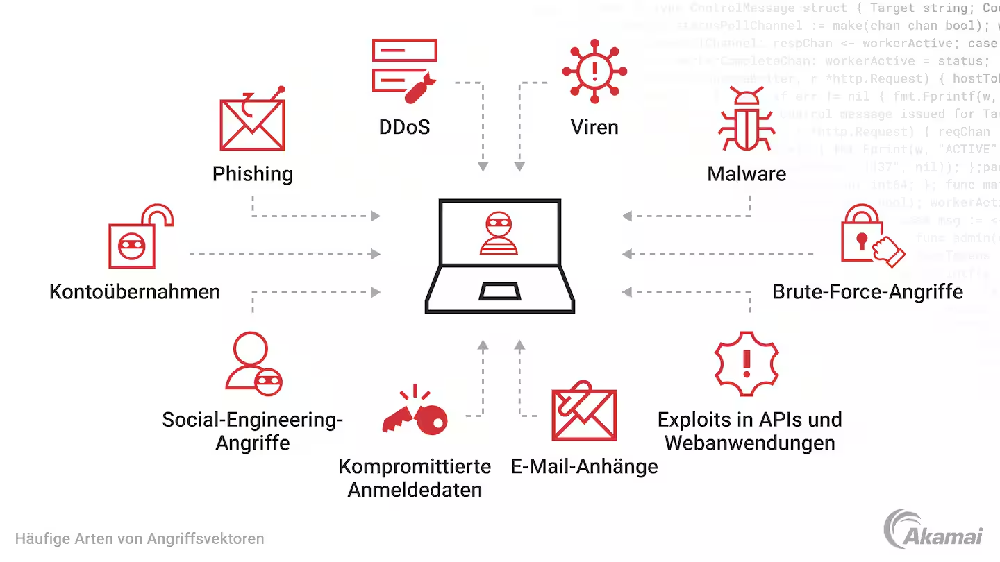

# Die Klassifizierung der Angriffsvektoren

## 1. Angriffsflächen

### Was ist die Angriffsfläche?
-  Die Angriffsfläche ist die Summe aller potenziellen Sicherheitsrisiken in der Software-Umgebung eines Unternehmens. Anders ausgedrückt: Sie ist die Gesamtheit aller potenziellen (bekannten und unbekannten) Schwachstellen und Kontrollen in allen Hardware-, Software- und Netzwerkkomponenten.

### Angriffsflächen lassen sich in drei Grundarten einteilen:

- ### Digitale Angriffsfläche:
    Diese umfasst das gesamte Netzwerk und die Software-Umgebung eines Unternehmens, einschließlich Anwendungen, Code, Ports sowie andere Eintritts- und Austrittspunkte.

- ### Physische Angriffsfläche:
    Die gesamte Infrastruktur eines Unternehmens wie: 
    - Desktop-Systeme 
    - Laptops 
    - mobile Geräte 
    - Server 
    - Zugangstore 
    - Telekommunikationsinfrastruktur 
    - Stromleitungen

- ### Social-Engineering-Angriffsfläche:
    Angriffe, die den menschlichen Geist ausnutzen und häufig bei: 
    - Phishing 
    - Pretexting (Smishing) 
    - Vishing (Voicemail) 

    und anderen manipulativen Techniken eingesetzt werden, um den Menschen in die Irre zu führen.

**Unternehmen sollten auf jeden Fall alle potenziellen Schwachstellen kennen. Hier soll es jedoch um die Angriffsfläche von Software-Anwendungen gehen. Dazu gehören alle möglichen Funktionen im Code einer Software-Umgebung, die durch nicht autorisierte Benutzer oder Malware ausgenutzt werden können.**

## 1. Arten von Angriffsvektoren

### Brute-Force-Angriffe
- Unter der Brute-Force-Methode (rohe Gewalt) versteht man das einfache ausprobieren aller oder vieler Passwörtkombinationen.

Sich schützen:

- Gegenmaßnahme ist die Verwendung möglichst komplexer und langer Passwörter und natürlich einen starken (also ungebrochenen) Verschlüsselungsalgorithmus.

### Exploits in APIs und Webanwendungen
- Ausnutzung von Schwachstellen in Programmierschnittstellen oder Webseiten, um Zugriff zu bekommen.

Sich schützen:

- Regelmäßige Updates und Sicherheitstests (z. B. Penetrationstests), sichere Programmierung.

### E-Mail-Anhänge
- Schadsoftware oder gefährliche Links in E-Mails, die beim Öffnen Schaden anrichten können.

Sich schützen:

- Misstrauen bei unbekannten Absendern, Virenscanner nutzen, E-Mails vor dem Öffnen prüfen.

### Kompromittierte Anmeldedaten
- Gestohlene Benutzernamen und Passwörter, mit denen Angreifer sich Zugang verschaffen.

Sich schützen:

- Starke, einzigartige Passwörter verwenden und Zwei-Faktor-Authentifizierung (2FA) aktivieren.

### Social-Engineering-Angriffe
- Täuschung von Menschen, um an vertrauliche Informationen zu kommen (z. B. durch Lügen oder Tricks).

Sich schützen:

- Mitarbeiterschulungen, kritisches Hinterfragen von Anfragen, keine sensiblen Infos preisgeben.

### Kontoübernahmen
- Wenn ein Angreifer sich in ein Benutzerkonto hackt und es übernimmt.

Sich schützen:

- 2FA, sichere Passwörter, ungewöhnliche Kontoaktivitäten sofort prüfen.

### Phishing
- Betrugsversuche per E-Mail, Website oder Nachricht, um Passwörter oder Daten zu stehlen.

Sich schützen:

- Links und Absender prüfen, niemals sensible Daten über E-Mails weitergeben.

### DDoS
- Überlastung eines Systems mit so vielen Anfragen, dass es nicht mehr erreichbar ist.

Sich schützen:

- DDoS-Schutzdienste einsetzen, z. B. über Cloudanbieter oder Firewalls.

### Viren
- Schadprogramme, die sich verbreiten und andere Dateien oder Systeme infizieren.

Sich schützen:

- Antivirus-Programme nutzen, verdächtige Dateien nicht öffnen, regelmäßig scannen.

### Malware
- Überbegriff für alle Arten von schädlicher Software (z. B. Viren, Trojaner, Spyware).

Sich schützen:

- Sicherheitssoftware, aktuelle Updates, keine Software aus unsicheren Quellen installieren.